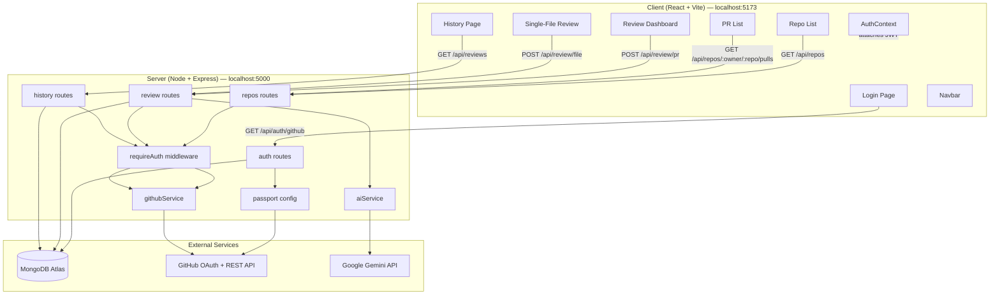
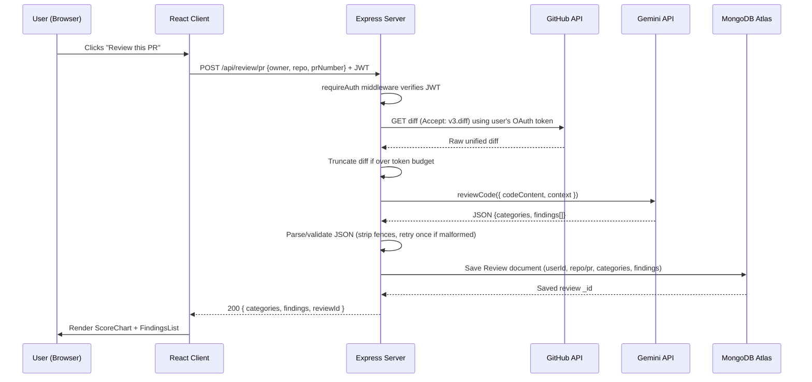
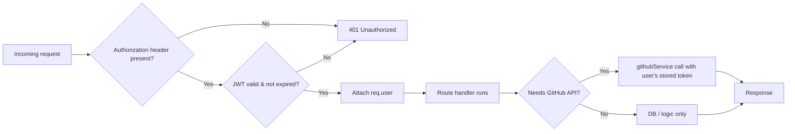
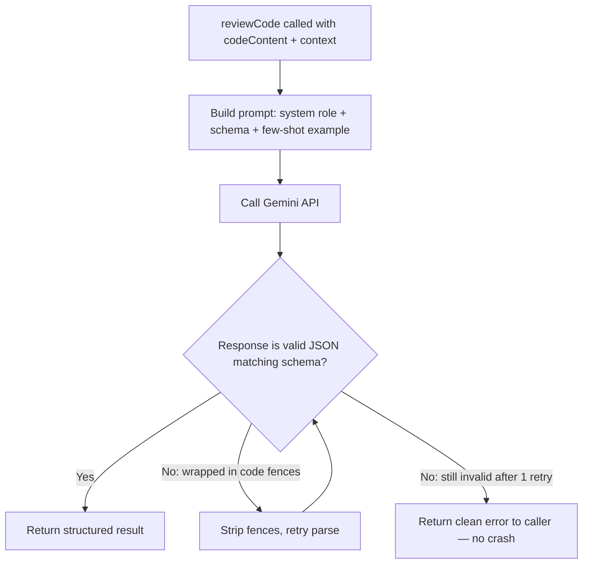

# CodeLens — System Architecture

*Day 2 Deliverable · MERN Stack · AI-Powered Multi-User Code Review Platform*

---

## 1. Tech Stack (Locked)

| Layer | Choice | Notes |
|---|---|---|
| Frontend | React 18 + Vite | SPA, no SSR needed |
| Backend | Node.js + Express | REST API, stateless |
| Database | MongoDB Atlas (M0 free) | Document store, nested findings |
| Auth | GitHub OAuth (Passport.js) + JWT | Stateless sessions |
| AI | Google Gemini API (`gemini-1.5-flash` or current free tier) | JSON-mode structured output; GitHub Models as fallback |
| Hosting | Render (backend) + Vercel/Netlify (frontend) | Free tier, auto-deploy from GitHub |
| Key libraries | mongoose, axios, recharts, multer, jsonwebtoken, passport-github2, cors, dotenv | |

---

## 2. Component Diagram

---

## 3. Data Flow — End-to-End Review Request

---

## 4. Request Lifecycle — Protected Route

---

## 5. AI Interaction Flow (aiService)

**Design note:** `aiService.reviewCode()` is intentionally the *only* function that talks to Gemini. Both `POST /api/review/pr` (Day 5) and `POST /api/review/file` (Day 7) call this same function — this was already the blueprint's plan and is confirmed as correct: it avoids prompt-logic duplication and guarantees PR reviews and file reviews always return the identical JSON shape, which is what lets `ReviewDashboard.jsx`'s `ScoreChart`/`FindingsList` components be reused for both without modification.

---

## 6. External Services

| Service | Purpose | Auth method | Rate/limits to watch |
|---|---|---|---|
| GitHub OAuth | User login | OAuth 2.0 authorization-code flow | N/A |
| GitHub REST API | Repo list, PR list, PR diff, (Day 8) inline comments | User's OAuth token (`Bearer`) | 5,000 req/hr authenticated |
| Google Gemini API | AI code review generation | API key (server-side only, never sent to client) | Free-tier requests/min — truncate large diffs to stay within token budget |
| MongoDB Atlas | Persistent storage (users, reviews) | Connection string (URI) with DB user credentials | M0 free tier: 512MB storage, shared RAM — sufficient for this project's scale |

---

## 7. Environment Variable Map

| Variable | Location | Used by |
|---|---|---|
| `PORT` | `/server/.env` | server.js |
| `MONGO_URI` | `/server/.env` | mongoose connection |
| `GEMINI_API_KEY` | `/server/.env` | aiService.js |
| `JWT_SECRET` | `/server/.env` | auth routes, requireAuth middleware |
| `GITHUB_CLIENT_ID` / `GITHUB_CLIENT_SECRET` | `/server/.env` | passport.js config |
| `GITHUB_CALLBACK_URL` | `/server/.env` | passport.js config (differs local vs. production — see Day 10) |
| `VITE_API_BASE_URL` | `/client/.env` | axios base config (points to localhost:5000 in dev, Render URL in production) |

*None of these are committed to git — confirmed via `.gitignore` during Step 0.*
