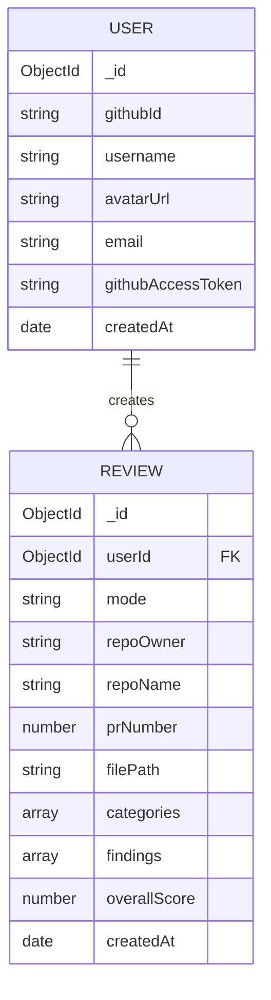

# CodeLens — Database Schema

*Day 2 Deliverable · MongoDB Atlas (Mongoose)*

---

## 1. Collections Overview

Two collections cover every feature in the blueprint through Day 9: **users** and **reviews**. No third collection is needed — repos and PRs are *not* stored locally; they're fetched live from GitHub each time and only referenced by ID/number inside a review document. This keeps the schema small and avoids a stale-data sync problem between GitHub and our DB.



---

## 2. `users` Collection

```javascript
{
  _id: ObjectId,
  githubId: { type: String, required: true, unique: true, index: true },
  username: { type: String, required: true },
  avatarUrl: { type: String },
  email: { type: String },
  githubAccessToken: { type: String, required: true }, // encrypted at rest is a Day-10 stretch goal, not required for v1.0
  createdAt: { type: Date, default: Date.now }
}
```

**Constraints & validation**
- `githubId` is unique and indexed — this is the natural key for "does this user already exist" checks during OAuth callback.
- `githubAccessToken` is required because every downstream repo/PR call depends on it — a user record without it is unusable, so it's never optional.
- No password field exists anywhere — GitHub OAuth is the only auth method, so there's nothing to hash or store beyond the token.

---

## 3. `reviews` Collection

```javascript
{
  _id: ObjectId,
  userId: { type: ObjectId, ref: 'User', required: true, index: true },
  mode: { type: String, enum: ['pr', 'file'], required: true },

  // present when mode === 'pr'
  repoOwner: { type: String },
  repoName: { type: String },
  prNumber: { type: Number },
  prTitle: { type: String },

  // present when mode === 'file'
  fileName: { type: String },

  categories: [{
    name: { type: String, required: true }, // e.g. "Security", "Performance", "Readability", "Best Practices"
    score: { type: Number, min: 0, max: 100, required: true }
  }],

  findings: [{
    category: { type: String, required: true },
    severity: { type: String, enum: ['low', 'medium', 'high', 'critical'], required: true },
    line: { type: Number },              // optional — AI may not always pinpoint a line
    message: { type: String, required: true },
    suggestion: { type: String }
  }],

  overallScore: { type: Number, min: 0, max: 100, required: true },
  createdAt: { type: Date, default: Date.now, index: true }
}
```

**Constraints & validation**
- `mode` is a strict enum — this is what lets the History page (Day 6) and Dashboard reuse one schema for two different input types without needing two collections.
- `categories[].score` and `overallScore` are bounded 0–100 — this range is what `ScoreChart.jsx` (recharts) assumes when rendering; enforcing it at the schema level prevents a malformed AI response from ever reaching the chart component.
- `findings[].severity` enum matches exactly the four severity levels the FindingsList UI component (Day 5) is built to color-code — keeping these in lockstep avoids an "unknown severity" rendering edge case.
- `line` is intentionally optional: Gemini can reliably point to a line for single-file review, but PR diffs sometimes make exact line attribution unreliable — the UI (Day 5/7) is designed to just omit the line badge when absent, not to error.

---

## 4. Validation Against User Stories

| User story (from PRD/blueprint) | Schema support |
|---|---|
| User logs in with GitHub | `users.githubId`, `users.githubAccessToken` — enough to authenticate and make GitHub API calls on their behalf |
| User sees their list of repos | Not stored — fetched live via GitHub API using `githubAccessToken`; no schema needed |
| User selects a PR and requests a review | `reviews` doc created with `mode: 'pr'`, `repoOwner`, `repoName`, `prNumber` |
| User uploads/reviews a single file | `reviews` doc created with `mode: 'file'`, `fileName` |
| User sees categorized scores on a dashboard | `categories[]` array with bounded `score` |
| User sees a list of specific findings with severity | `findings[]` array with `severity` enum |
| User views their past review history | `reviews` filtered by `userId`, sorted by indexed `createdAt` |
| Multiple users use the platform independently | Every review is scoped by `userId` — no cross-user data leakage possible at the query level |

Every story maps to an existing field — no gaps found, no schema changes required to the blueprint's original plan.

---

## 5. Indexes

```javascript
// users
{ githubId: 1 } // unique

// reviews
{ userId: 1, createdAt: -1 } // compound — powers the History page's "most recent first, this user only" query in one index
```
