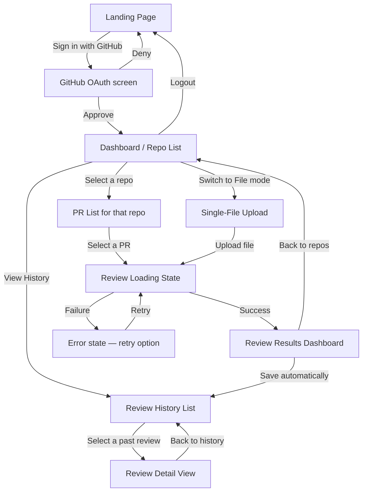
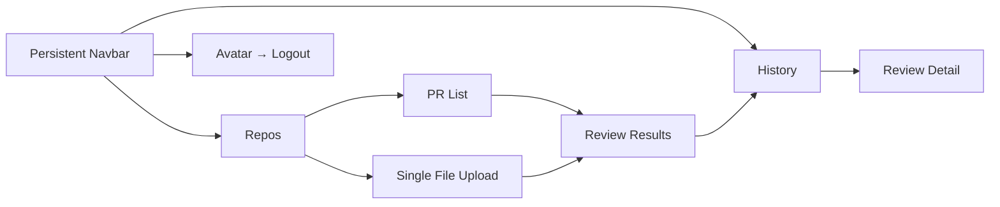

# CodeLens — UI & User Flow

*Day 2 Deliverable · Low-fidelity wireframes + navigation map*

---

## 1. User Flow Diagram



---

## 2. Screen Inventory — Every Screen Exists For a Reason

| Screen | Why it exists | What breaks if it's removed |
|---|---|---|
| Landing Page | Unauthenticated entry point + value prop for a portfolio viewer | Reviewers judging this project would land straight on a login redirect with no context |
| Dashboard / Repo List | Core hub — first thing a logged-in user needs | No way to pick *what* to review |
| PR List | Narrows a repo down to a specific reviewable unit | User would have to know PR numbers manually |
| Single-File Upload | Serves the "quick check, no repo needed" use case (Day 7) | Forces every review through the full GitHub OAuth+repo flow, a real friction point for a demo |
| Review Loading State | AI calls take a few seconds — masks latency, prevents duplicate submissions | User might click twice, double-submitting a review |
| Review Results Dashboard | The actual product value — scores + findings | This *is* the product; nothing else matters without it |
| Review History | Lets a user (or a recruiter watching a demo) see the tool used repeatedly over time | Every review becomes disposable, undermining the "track code quality over time" value prop |
| Review Detail View | History list can't show full findings inline without becoming unreadable | Clicking a past review would just re-show the same cramped list |

No screen was added beyond what the blueprint already implied by Day 5–7 — this table is here to confirm the set is *minimal*, not to introduce new screens.

---

## 3. Low-Fidelity Wireframes

### Dashboard / Repo List
```
┌─────────────────────────────────────────────────┐
│ CodeLens        [Repos] [History]     [👤 avatar]│
├─────────────────────────────────────────────────┤
│  Your Repositories                [+ Review a    │
│                                      single file] │
│  ┌───────────────────────────────┐               │
│  │ 📁 my-portfolio-site           │               │
│  │    updated 2 days ago      >   │               │
│  ├───────────────────────────────┤               │
│  │ 📁 codelens                    │               │
│  │    updated 1 hour ago      >   │               │
│  ├───────────────────────────────┤               │
│  │ 📁 old-school-project           │               │
│  │    updated 4 months ago    >   │               │
│  └───────────────────────────────┘               │
└─────────────────────────────────────────────────┘
```

### PR List (after selecting a repo)
```
┌─────────────────────────────────────────────────┐
│ CodeLens   ← codelens              [👤 avatar]   │
├─────────────────────────────────────────────────┤
│  Open Pull Requests                              │
│  ┌───────────────────────────────┐               │
│  │ #12  Add auth middleware        │               │
│  │      opened by ridak5845    >  │               │
│  ├───────────────────────────────┤               │
│  │ #9   Fix CORS config             │               │
│  │      opened by ridak5845    >  │               │
│  └───────────────────────────────┘               │
└─────────────────────────────────────────────────┘
```

### Review Results Dashboard
```
┌─────────────────────────────────────────────────┐
│ CodeLens   PR #12 — Add auth middleware          │
├─────────────────────────────────────────────────┤
│  Overall Score: 78/100                           │
│                                                   │
│   ┌─── ScoreChart ───┐                           │
│   │ Security     82  │                           │
│   │ Performance  90  │  (bar chart, recharts)     │
│   │ Readability  65  │                           │
│   │ Best Prac.   75  │                           │
│   └──────────────────┘                           │
│                                                   │
│  Findings                                        │
│  ┌───────────────────────────────┐               │
│  │ 🔴 CRITICAL · Security · L42   │               │
│  │ Hardcoded JWT secret found      │               │
│  │ Suggestion: move to env var     │               │
│  ├───────────────────────────────┤               │
│  │ 🟡 MEDIUM · Readability · L10  │               │
│  │ Function exceeds 80 lines       │               │
│  └───────────────────────────────┘               │
└─────────────────────────────────────────────────┘
```

### Single-File Upload
```
┌─────────────────────────────────────────────────┐
│ CodeLens   Single File Review      [👤 avatar]   │
├─────────────────────────────────────────────────┤
│                                                   │
│        ┌─────────────────────────────┐           │
│        │   Drag & drop a file here    │           │
│        │        or click to browse    │           │
│        └─────────────────────────────┘           │
│                                                   │
│              [ Review This File ]                │
└─────────────────────────────────────────────────┘
```

### Review History
```
┌─────────────────────────────────────────────────┐
│ CodeLens   History                 [👤 avatar]   │
├─────────────────────────────────────────────────┤
│  ┌───────────────────────────────┐               │
│  │ PR #12 · codelens · 78/100      │               │
│  │ 2 hours ago                 >  │               │
│  ├───────────────────────────────┤               │
│  │ utils.js (file) · 91/100        │               │
│  │ yesterday                   >  │               │
│  └───────────────────────────────┘               │
└─────────────────────────────────────────────────┘
```

---

## 4. Navigation Map



**Rule confirmed:** the Navbar (Repos / History / Avatar) is present on every authenticated screen — this is the only persistent navigation element, keeping the app to a single, predictable navigation model rather than screen-specific nav variations.
